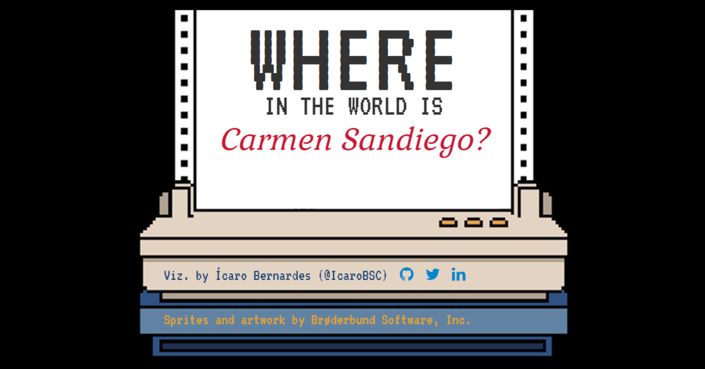

# Where in the World is Carmen Sandiego?

This work pays homage to one of the best educative games of all time. The [**page**](https://icarobernardes.github.io/carmen_sandiego_DOS/) simulates the gist of its gameplay:

### You are a detective that has to recover an important piece stolen by a V.I.L.E operative.

### By interviewing the locals you get clues about the whereabouts of the suspect and their identity.

### This chase will take you all over the world...

### The adventure ends with you matching features of the criminal, issuing a arrest mandate for them and recovering the stolen item from their hideout.

## The process

This dataviz was made with R, mostly `{ggiraph}`, in Quarto. I specially like how the sprites fit really well in the piece as well as the many tricks I used to make the tooltips and hover animations. I also did some extra work with the sprites: using `{ggpath}` to put them in the page, `{ggfx}` to make borders around them and `{magick}` to manipulate images.

## Authorship

This dataviz was made by Ícaro Bernardes. To see more pieces like this follow me at:

- Twitter: [@IcaroBSC](https://twitter.com/icarobsc)
- Github: [@IcaroBernardes](https://github.com/IcaroBernardes)
- Linkedin: [@icarobsc](https://www.linkedin.com/in/icarobsc/)

Sprites and artwork were made by Brøderbund Software, Inc.
